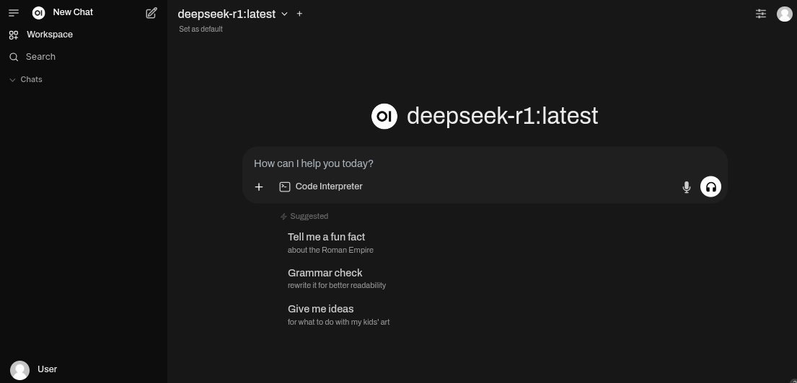

# ollama-intel-arc

A Docker-based setup for running Ollama as a backend and Open WebUI as a frontend, leveraging Intel Arc Series GPUs on Linux systems.

## Overview
This repository provides a convenient way to run Ollama as a backend and Open WebUI as a frontend, allowing you to interact with Large Language Models (LLM) using an Intel Arc Series GPU on your Linux system.  



## Services
1. Ollama  
   * Runs llama.cpp and Ollama with IPEX-LLM on your Linux computer with Intel GPU.  
   * Built following the guidelines from [Intel](https://github.com/intel-analytics/ipex-llm/blob/main/docs/mddocs/Quickstart/llama_cpp_quickstart.md).  
   * Uses [Ubuntu 24.04 LTS](https://ubuntu.com/blog/tag/ubuntu-24-04-lts), Ubuntu's latest stable version, as a container.
   * Uses the latest versions of required packages, prioritizing cutting-edge features over stability.  
   * Exposes port `11434` for connecting other tools to your Ollama service.  
   * To validate this setup, run: `curl http://localhost:11434/`  

2. Open WebUI  
   * The official distribution of Open WebUI.  
   * `WEBUI_AUTH` is turned off for authentication-free usage.  
   * `ENABLE_OPENAI_API` and ENABLE_OLLAMA_API flags are set to off and on, respectively, allowing interactions via Ollama only.  

## Setup

### Fedora
```bash
$ git clone https://github.com/eleiton/ollama-intel-arc.git
$ cd ollama-intel-arc
$ podman compose up
```

### Others (Ubuntu 24.04 or newer)
```bash
$ git clone https://github.com/eleiton/ollama-intel-arc.git
$ cd ollama-intel-arc
$ docker compose up
```
## Usage
* Run the services using the setup instructions above.  
* Open your web browser to http://localhost:3000 to access the Open WebUI web page.  
* For more information on using Open WebUI, refer to the official documentation at https://docs.openwebui.com/ .

## References
* [Intel guidelines for installing Linux GPU support](https://github.com/intel-analytics/ipex-llm/blob/main/docs/mddocs/Quickstart/install_linux_gpu.md)  
* [Open WebUI documentation](https://docs.openwebui.com/)
